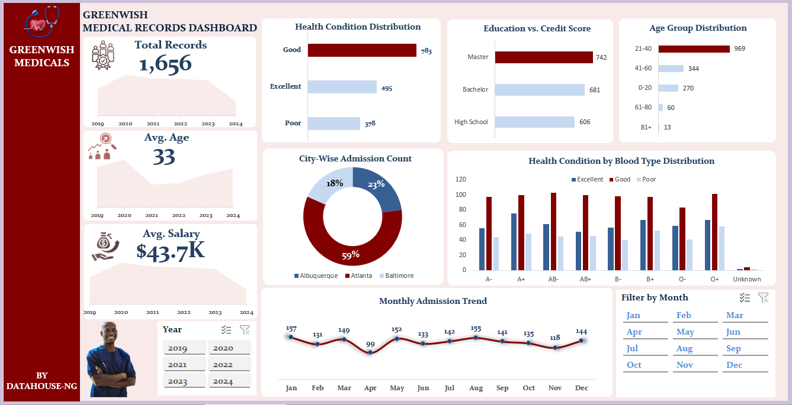
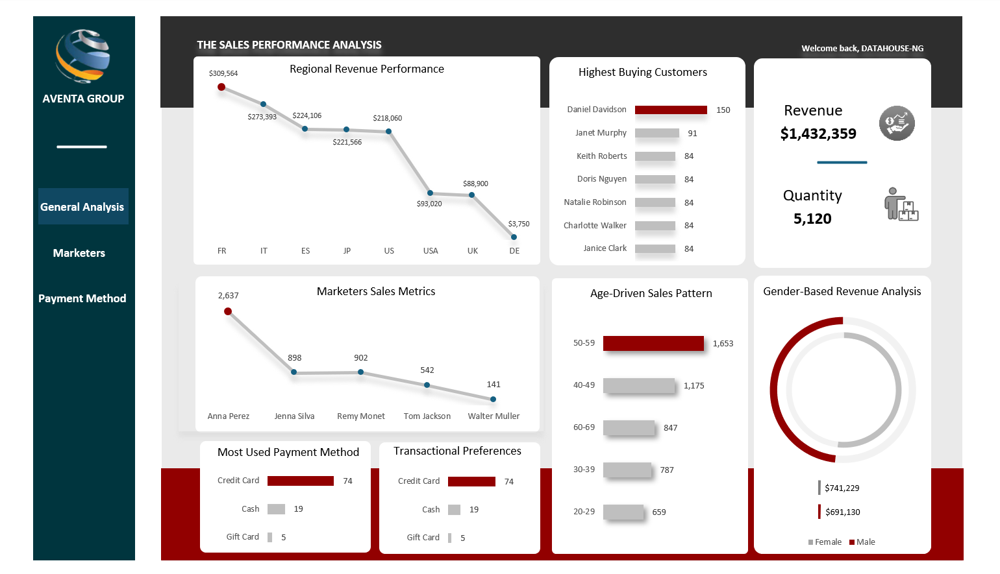
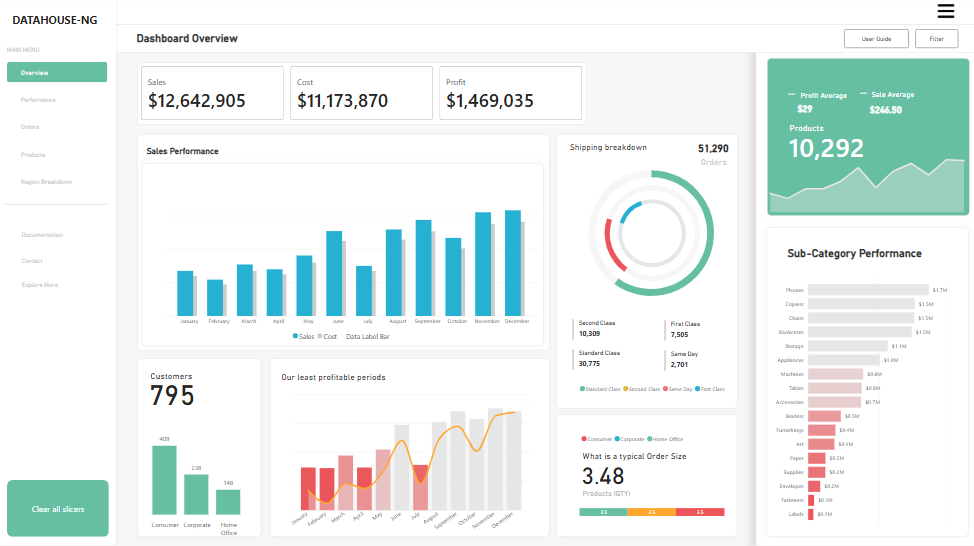

<!--Section 1: Introduce your self-->
## ABOUT ME

Hello! I'm Eniola Oluwashola, a professional data analyst, educator, data researcher, data aggregator, data collector, and a data consultant. 
With a suite of experience and expertise spanning data analytics, data & market research, data collection & aggregation (Kobo Toolbox Expertise), mobile data collection using KoBoToolBox, I have delivered data projects consulting for FMCGs, businesses & organizations.

## ACHIEVEMENT

- Delivered 6000 retail audits for Pladis Global across 6 States in Nigeria, using the Kobo Toolbox for raw data collection.

- Delivered a nationwide market research project with a new entrant (CHLOE Diaper) into the disposable diaper industry (Surveyed 350 wholesales stores, 750 retail stores, 100 Key-In-depth Interviews, 25 Focus Group Discussions) across key cities in Nigeria.

- Delivered retail audit for Pladis Global Nigeria, aggregating data of approximately 5000 retail outlets in open-air markets and neighborhoods (Lagos Only) and also using the Kobo Toolbox for raw data collection.

- Trained over 5,000 in Data Analytics covering Data Research & Data Aggregation (Kobo Toolbox), Advanced Data Visualization. Power-BI, Excel, SQL & Tableau.

<!--Mention your top/relevant skills here - core and soft skills-->
## WHAT I DO

As the Chief Analyst of DATAHOUSE-NG, I provide consulting and training services for organizations, businesses, executives, individuals and mentor aspiring analysts.

**- Data Analytics Consulting.**
I provide in-depth analysis and tailored solutions to help you make data-driven decisions, optimize processes, and drive business growth. 

**- Staff Training & Development.**
I offer comprehensive training programs in data analysis, advanced visualization, mobile data collection using KoBoToolBox and data-driven decision-making. From beginner to advanced levels. 

## SKILLS

*- Power-BI*
*- Excel*
*- Advanced Visualization*
*- Kobo Toolbox*
*- Data Research*
*- Data aggregation*
*- Mobile Data Collection*
*- Data Markeing & Research*
*- DAX Writing*
*- Power Query Editor*
*- Tableau*
*- SQL*
*- Data appending & merging*
*- Data wrangling, data analysis, data cleaning & transformation, data modelling*

<!--Section 2: List 3-4 key projects-->
## MY PROJECTS

*A glimpse of some of the projects I've been working on.*

**How I helped GREENWISH MEDICALS to provide actionable insights into patient demographics, health 
conditions, and trends in admissions using their raw medical data, thereby operational efficiency by 75%.**

As a data analyst, I was tasked with working on a healthcare dataset to develop an interactive Excel dashboard aimed at analyzing and visualizing key healthcare metrics. 
This dashboard is designed to deliver actionable insights into patient demographics, health conditions, trends in admissions, and enhancing overall operational efficiency by 75%.

[Read More](In creating an interactive Excel dashboard for analyzing key healthcare metrics, I followed a structured approach:

1- Data Collection and Preparation: I acquired a healthcare dataset with relevant information, performed data cleaning to ensure accuracy, and transformed the data for analysis by categorizing health conditions and creating calculated metrics.

2- Data Analysis: I conducted exploratory data analysis (EDA) to identify patterns and selected essential metrics for the dashboard, including patient demographics and admission trends.

3- Dashboard Design: I designed a user-friendly layout, incorporating interactive features like slicers and drop-down menus to enhance user engagement and facilitate data filtering.

4- Data Visualization: I utilized various chart types to visualize the data effectively and applied conditional formatting to highlight key trends and insights.

5- Testing and Feedback: After the initial version was completed, I conducted user testing to gather feedback and made iterative improvements based on stakeholder input.

6- Finalization and Presentation: I created documentation for user navigation and presented the final dashboard to stakeholders, demonstrating its features and utility in making data-driven decisions.

Through this methodical process, I successfully developed a dashboard that provides valuable insights into patient demographics, health conditions, and admission trends, ultimately enhancing decision-making in healthcare management.)

**The Aventa Group Transactional Metrics Analysis.**

The Aventa Group wants to know how and if regional performance, marketers sales metrics, customers, customer age group, gender, generates any transactional pattern, trends and hidden business discoveries. 

[Read More](

As a professional data analyst, I addressed The  Aventa Group's concerns about regional performance, sales metrics, customer demographics, and transactional patterns through the following steps:

1. Data Collection: I gathered data from sales records, customer databases, and regional reports to create a comprehensive dataset.

2. Data Cleaning: I cleaned the dataset to remove inconsistencies and categorize customers by age and gender.

3. Exploratory Data Analysis (EDA): I analyzed patterns and trends in sales metrics by region and demographics to uncover relationships.

4. Trend Analysis: I examined sales trends over time, focusing on contributions from different age groups and genders.

5. Pattern Recognition: I used data visualization to highlight hidden patterns in customer behavior and purchasing decisions.

6. Actionable Insights: I presented findings to the Aventa Group, offering insights to inform marketing strategies and enhance customer engagement.

This structured approach enabled the Aventa Group to solve their business concerns.)

**How I helped Daxxon company to discover hidden metrics in their business data that influenced their performance by 45% in revenue and qty sold.**

.PNG)

I assisted Daxxon Company in uncovering hidden metrics within their business data, leading to a 45% increase in revenue and quantity sold by focusing on the following insights:

[Read More] (City Sales Performance: I analyzed sales data by city to identify top-performing regions, allowing Daxxon to target marketing efforts effectively.

Managers Evaluation: I evaluated manager performance metrics, highlighting effective strategies and areas for improvement, which helped optimize team productivity.

Payment Method Analysis: By examining payment methods, I identified preferences that influenced customer purchasing behavior, enabling tailored payment options.

Purchase Type Insights: I categorized purchase types to understand customer preferences, leading to targeted promotions that boosted sales.

Quantity Metrics: I analyzed quantity sold metrics to identify trends, helping the company adjust inventory and sales strategies accordingly.

Revenue Generation Timing: I pinpointed periods when Daxxon generated the highest revenue, allowing for strategic planning of sales campaigns during peak times.

Through these data insights, Daxxon was able to make informed decisions that significantly enhanced their performance, resulting in a substantial increase in both revenue and quantity sold.)

**PBI - Enhancing Business Performance with Exploratory Data Analysis in Power BI.**

Using Exploratory Data Analysis (EDA) in Power BI, I discovered hidden metrics that contributed to a 35% increase in overall business performance.

[Read More] (1- Subcategory Performance: I analyzed sales data by subcategory, identifying high-performing and underperforming segments. This insight allowed for targeted marketing and inventory adjustments.

2- Identifying Least Profitable Periods: I calculated the least profitable periods by examining sales and profit trends over time. This analysis helped the company recognize and address seasonal dips in performance.

3- Customer Analysis: I conducted a detailed customer analysis to segment customers based on purchasing behavior, preferences, and profitability. This understanding enabled personalized marketing strategies to enhance customer engagement.

4- Shipping Breakdown: I examined shipping data to identify cost patterns and delivery times, allowing for optimization of shipping processes and reduction of costs associated with logistics.

5- Sales Performance Analysis: I evaluated sales performance in relation to revenue, profit, and average sales metrics. This comprehensive view provided insights into overall business health and areas for improvement.

Through these EDA techniques in Power BI, I uncovered critical metrics that informed strategic decisions, ultimately leading to a significant boost in business performance.)

**Delivered 6000 retail audits for Pladis Global across 6 States in Nigeria using Kobo Toolbox for data collection & data aggregation.**

### Implementation of Branded Data Collectors Using Kobo Toolbox

I, deployed branded data collectors in the field utilizing **Kobo Toolbox** on their mobile devices, offering several key advantages:

1. **Streamlined Data Collection**:
   - **Mobile Accessibility**: Real-time data entry ensures accuracy and timeliness.
   - **User-Friendly Interface**: Kobo Toolbox’s intuitive design facilitates efficient data entry, even in low-connectivity areas.

2. **Branding and Consistency**:
   - **Branded Experience**: Data collectors use branded materials to reinforce our identity.
   - **Standardized Forms**: Customized forms ensure uniformity in data collection protocols.

3. **Real-Time Data Monitoring**:
   - **Instant Data Upload**: Data can be uploaded immediately when connectivity is available, allowing for real-time monitoring.
   - **Quality Control**: Supervisors can provide prompt feedback to enhance data quality.

4. **Enhanced Data Security**:
   - **Secure Storage**: Kobo Toolbox offers secure data storage, protecting sensitive information.
   - **Access Control**: User permissions can be managed to restrict access to sensitive data.

5. **Comprehensive Reporting**:
   - **Data Visualization**: Tools for visualizing data enable quick insights.
   - **Export Options**: Collected data can be easily exported for further analysis.

By utilizing Kobo Toolbox with our branded data collectors, we improve the efficiency, accuracy, and reliability of our data collection processes, supporting better decision-making and strategic planning.

## CONTACT DETAILS

*Let’s connect and see how we can make a difference together!*
<table>
  <tbody>
    <tr>
      <td>📧</td>
      <td><a href="mailto:eniolaoluwasholao@gmail.com">eniolaoluwasholao@gmail.com</a></td>
    </tr>
    <tr>
      <td>📞</td>
      <td>(234) 916-602-0709</td>
    </tr>
    <tr>
      <td>📍</td>
      <td>Lagos, Nigeria</td> 
       <td>🌐</td>
      <td><a href="https://www.linkedin.com/in/eniola-oluwashola-mcda-mnim-acipurs-ba9a1b232/">The things I do daily on LinkedIn</a></td>
    </tr>
    <tr>
   
