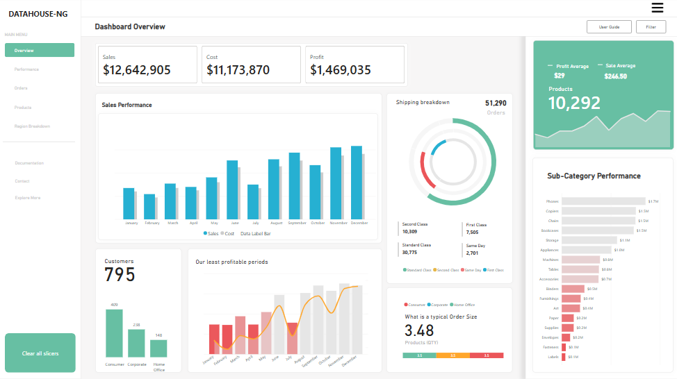

<!--Section 1: Introduce your self-->
## ABOUT ME

Hello! I'm Eniola Oluwashola, a professional data analyst, visualizaton specialist, educator, data researcher, data aggregator and a  data collector. 

I'm a Microsoft Certified Data Analyst and Business Analyst with a background most "data people" don't have: I've collected the data myself; running large-scale FMCG retail audits and market research fieldwork, before I ever built a dashboard from it. That ground-up view shapes how I work now. I don't just visualize numbers; I question where they came from, what's missing, and what decision they're meant to support.

I'm currently open to a full-time remote Data Analyst role in operations, international development, sales & customers or fintech, and ready to bring all of this directly to one team.

## ACHIEVEMENT

- Delivered 6000 retail audits for Pladis Global across 6 States in Nigeria, using the Kobo Toolbox for raw data collection, data & business analysis and the building of executive dashboards that aided management business decisions.

- Delivered a nationwide market research project with a new entrant (CHLOE Diaper) into the disposable diaper industry (Surveyed 350 wholesales stores, 750 retail stores, 100 Key-In-depth Interviews, 25 Focus Group Discussions) across key cities in Nigeria.

- Delivered retail audit for Pladis Global Nigeria, aggregating data of approximately 5000 retail outlets in open-air markets and neighborhoods (Lagos Only) and also using the Kobo Toolbox for raw data collection.

- Trained over 5,000  across Data Analysis, Business Analysis, Project Management, UI/UX, AI, Agile Delivery (Scrum & Kanban), Monday.com, and KoboToolbox-based field research.

<!--Mention your top/relevant skills here - core and soft skills-->
## WHAT I DO

I'm a Data & Business Analyst who builds the executive dashboards, models, and reports organizations use to make decisions; across operations, international development, sales & customers, fintech, FMCG,and  NGO/international development.

Over 10+ years, I've run market research and field data collection projects (KoboToolbox), built Power BI and Excel dashboards for supply chain, microfinance, and public health teams, and turned messy field-level data into KPIs that the leadership can act on.

I've also trained 7,000+ professionals in Data Analysis, Business Analysis, Power BI, SQL, and Agile delivery, which means I'm just as comfortable explaining the "why" behind a number to a non-technical stakeholder as I am building the dashboard itself.

I'm looking for a full-time, remote Data Analyst or Business Analyst role where I can bring that same rigor to one team. 

## Technical Skills

- **Data Analysis & Visualization** — Power BI, Tableau, Excel; executive-ready, decision-driving dashboards
- **Data Wrangling & Quality Assurance** — SQL queries and Excel Power-Query for cleaning and structuring data at scale
- **Business & Requirements Analysis** — stakeholder interviews, process mapping, BRDs
- **Data & Market Research** — quantitative and qualitative study design, fieldwork, reporting
- **Mobile Data Collection & Aggregation** — KoboToolbox form design, field deployment, large-scale data cleaning
- **KPI & Performance Reporting** — sales, supply chain, M&E, RFM Analysis (customer segmentation), and portfolio-risk dashboards.

## Soft Skills

- **Stakeholder Communication** — translating technical findings into language executives and non-technical teams can act on immediately
- **Cross-Sector Adaptability** — comfortable moving between FMCG, NGO/international development, and fintech contexts without a learning-curve tax
- **Mentorship & Knowledge Transfer** — trained 7,000+ professionals, which means I default to explaining reasoning, not just handing over output
- **Remote & Distributed Coordination** — used to managing field teams, deadlines, and stakeholder check-ins across multiple locations and time zones, asynchronously
- **Problem Diagnosis** — comfortable sitting with ambiguous or incomplete data and figuring out what question it can actually answer
- **Attention to Detail** — a data-collection background means I catch quality issues before they become a dashboard's bad assumption

<!--Section 2: List 3-4 key projects-->
## MY PROJECTS

**Case Study 1 - Executive Sales Analytics Dashboard: Revenue Optimization and Performance Intelligence.**

**Tech Stack:** Power Query, Power Pivot, DAX, Excel (PivotTables, Conditional Formatting, Charts & Dashboard Design)

Data was cleaned, transformed and loaded using Power Query, then modeled in Power Pivot using a star schema with a dedicated date table built for time series analysis. DAX measures powered the month over month calculations and the gap analysis behind each KPI, and Excel PivotTables, conditional formatting, and native charting tools brought the executive dashboard to life.

**Business Problem**

The business experienced declining revenue despite continued sales activity. Leadership needed visibility into sales performance, product contribution, market effectiveness, and revenue trends to identify growth opportunities and close performance gaps.

**Executive Summary**

Using Excel, I built a Sales Performance Dashboard to evaluate revenue trends, sales representative performance, product distribution, and geographic market contribution.

The analysis showed $454.6K in revenue from 553 units sold, with revenue down 33.2% month over month while quantity sold fell only 1.8%. The dashboard exposed clear performance gaps across sales reps, products, and markets, and turned those gaps into specific, actionable steps for revenue recovery.

**Key Insights**

**Revenue Performance**

- Total Revenue: $454.6K
- Revenue Growth: -33.2% MoM
- Quantity Sold: 553 Units
- Quantity Growth: -1.8% MoM

Revenue fell more than eighteen times faster than unit volume. That gap points to pricing, discounting, or product mix changes as the driver of the decline, not a drop in demand.

**Monthly Revenue Trend**

- Highest Revenue Month: June ($60,679)
- Lowest Revenue Month: August ($13,221)

Revenue dropped 78.2% from June to August. A swing that steep is too large for normal seasonal variation and is worth investigating directly, whether it traces back to a stocking issue, a paused campaign, or a one-time event.

**Sales Rep Performance**

- Top Performer: David ($112,507)
- Lowest Performer: John ($57,175)

David generated 96.8% more revenue than John, the lowest-performing rep. That gap is large enough to justify documenting David's approach and sharing it across the team.

**Market Performance**

- Highest Revenue Market: USA ($124,424)
- Lowest Revenue Market: Canada ($58,982)

The USA contributed 27.37% of total revenue and generated 111% more revenue than Canada. That creates a growth opportunity in the USA, but also a concentration risk if the business leans too heavily on a single market.

**Product Performance**

- Top Product: Headphones (144 Units)
- Lowest Product: Smartwatch (83 Units)

Headphones made up 26.04% of total sales volume, the highest share of any product, while Smartwatch trailed at 15.01%, the lowest. That gap points to room for rebalancing the product portfolio.

**Recommendations**

1. Investigate the pricing, discounting, and product mix changes behind the 33.2% revenue decline.
2. Document David's sales approach and share it across the team to close the gap with lower-performing reps.
3. Increase investment in the USA, the strongest market, while building a clear growth plan for Canada.
4. Prioritize inventory and marketing spend on the top-selling products: Headphones, Laptop, and Phone.
5. Review Smartwatch and Tablet, the two lowest-selling products, for repositioning, bundling, or discontinuation.

**Business Impact**

This analysis:

- Identified a 33.2% revenue decline before it could grow into a larger business risk.
- Revealed a 96.8% performance gap between the top and bottom sales representatives.
- Highlighted a 111% revenue gap between the USA and Canada, the highest and lowest performing markets.
- Exposed a 73.5% volume gap between Headphones and Smartwatch, showing both a concentration risk and an opportunity to rebalance the product mix.
- Turned these findings into specific recommendations for revenue recovery and stronger sales execution.

**Business Impact Statement**

I built an Excel-based Sales Performance Dashboard to track revenue trends, sales team effectiveness, product performance, and market contribution. The dashboard surfaced a 33.2% revenue decline against a flat 1.8% drop in volume, a 96.8% gap between the top and bottom sales reps, and a 111% revenue gap between the strongest and weakest markets, then converted those findings into a clear set of recommendations for revenue recovery and stronger sales execution.

**Case Study 2 - Enterprise Customer Retention Intelligence Using RFM Analytics**

**Tech Stack:** Excel, Power Query, Power Pivot, DAX, PivotTables, Conditional Formatting, Data Modelling.

Customer data was transformed and loaded using Power Query, then modeled in Power Pivot. RFM scores were calculated using the PERCENTILE function on a 1 to 10 scale for recency, frequency, and monetary value, then combined to classify customers into High Value, Active, At Risk, and Churned segments. DAX measures powered the year over year revenue comparison and the segment level metrics, while PivotTables and conditional formatting were used to build out the dashboard. I also did a data modelling using the star-schema and snowflakes.

**Business Problem**

The business lacked visibility into customer value, churn risk, and revenue concentration, even as overall revenue declined year over year. Leadership needed a clear way to identify high value customers, reduce churn, and uncover growth opportunities through customer segmentation.

**Executive Summary**

Using Excel and the RFM (Recency, Frequency, Monetary) framework, I built a Customer Retention Intelligence Dashboard that analyzed 1,794 customers across a five year period from 2019 to 2024. Total revenue stood at $6.44M, down 6.3% from the prior year. The analysis identified $1.55M in revenue at churn risk, uncovered 94 upsell opportunities, and showed that a small segment of customers drives most of the business's revenue.

**Key Insights**

**Revenue Is Declining Year Over Year**

- Total Revenue: $6,440,115 ($6.44M)
- Year over Year Change: -6.3% vs Prior Year

Revenue fell 6.3% compared to the prior year, the exact trend this RFM analysis was built to explain and reverse.

**High Value Customers Drive a Third of Revenue**

- Revenue: $2.20M
- Customers: 334
- Revenue Contribution: 34.22%

Only 18.62% of customers generate over a third of total revenue, which makes retaining this group a top priority.

**At Risk Customers Carry $1.55M in Exposure**

- Revenue at Risk: $1.55M
- Customers: 580
- Revenue Share: 24.10%

Nearly one third of customers, 32.33% of the base, show signs of declining engagement, creating a real revenue recovery opportunity if they are re engaged before they churn.

**Churn Has Already Cost the Business $484,741**

- Churned Customers: 362
- Revenue Lost: $484,741

More than 20% of customers, 20.18% of the base, have already disengaged, taking nearly half a million dollars in revenue with them.

**Revenue Is Concentrated Among a Small Group**

- Top 20% of customers generate 67.1% of total revenue

The business follows a classic Pareto pattern, which means it depends heavily on a relatively small group of high value customers.

**Upsell Opportunities Exist**

- 94 customers were identified as strong candidates for upselling and cross selling.

These 94 customers already show strong engagement, which makes them the fastest path to additional revenue without acquiring new customers.

**Churn Spiked in February and Eased in January**

- Highest Churn Increase: February (+18.0%)
- Largest Churn Reduction: January (-8.9%)

Churn moves up and down throughout the year, which means retention campaigns need to target specific high risk months rather than running at a constant pace year round.

**Recommendations**

1. Build a VIP retention program for the high value customers who contribute 34.22% of revenue.
2. Launch targeted recovery campaigns for the 580 at risk customers representing $1.55M in revenue.
3. Set up predictive churn monitoring with automated retention alerts.
4. Run personalized upsell campaigns for the 94 high potential customers.
5. Reduce revenue concentration risk by increasing engagement among Active and At Risk customers, the two largest segments outside the High Value group.

**Business Impact**

This dashboard enabled the business to:

- Identify $1.55M in revenue exposed to churn risk.
- Quantify $484,741 in lost revenue from customers who already churned.
- Discover 94 immediate upsell opportunities.
- Reveal that 67.1% of revenue comes from the top 20% of customers.
- Segment 1,794 customers into four groups, High Value, Active, At Risk, and Churned, each with a clear retention or growth action attached.

**Business Impact Statement**

I built an RFM based Customer Retention Intelligence Dashboard in Excel that segmented 1,794 customers into four groups based on recency, frequency, and monetary value. The dashboard identified $1.55M in at risk revenue, uncovered 94 upsell opportunities, and showed that the top 20% of customers generate 67.1% of total revenue. It gives leadership a clear view of where to focus retention efforts and where revenue is most exposed, backed by segment level evidence rather than guesswork.

**Case Study 3 - Enterprise Business Performance Intelligence Dashboard**

**Tech Stack:** Power BI, Power Query, DAX, Star Schema and Snowflake Modeling

Data was transformed using Power Query, then modeled using a combination of star schema and snowflake schema design, supported by a comprehensive date table built for time based analysis. DAX measures powered the KPI cards, the profit margin calculation, and the seasonal, customer, and shipping breakdowns across the dashboard.

**Business Problem**

The business needed a centralized view of financial, operational, customer, and product performance to determine whether revenue growth was translating into sustainable profitability and operational efficiency.

**Executive Summary**

Using Power BI, I built an Enterprise Business Performance Dashboard that brings sales, profitability, customer segmentation, product performance, and shipping operations into one executive view.

The analysis found $12.64M in sales, $1.47M in profit, and 51,290 orders, while uncovering thin profit margins, product revenue concentration, seasonal sales patterns, and clear opportunities to improve operational efficiency.

**Key Insights**

**Financial Performance**

- Total Sales: $12.64M
- Total Cost: $11.17M
- Total Profit: $1.47M
- Profit Margin: 11.62%

Despite strong revenue, about 88% of every dollar gets absorbed by operating and product costs, which keeps profitability thin and exposed to any rise in cost.

**Seasonal Sales Trends**

Sales build steadily from July through December, with November and December standing out as the strongest months of the year. That points to a clear seasonal demand pattern the business can plan inventory, marketing, and staffing around.

**Product Performance**

- Phones: $1.7M
- Copiers, Chairs, and Bookcases: approximately $1.5M each
- Storage: $1.1M

These five sub categories make up a large share of total revenue, which means the business depends on a relatively small group of products for most of its performance.

**Customer Segmentation**

- Consumer: 409
- Corporate: 238
- Home Office: 148

Consumers make up 51.4% of the customer base, making them the largest revenue driving segment and the clearest target for retention focused initiatives.

**Operational Performance**

- Total Orders: 51,290
- Products Sold: 10,292
- Average Order Size: 3.48 products

Standard Class handles the majority of shipping volume at 30,775 orders, followed by Second Class at 10,309, First Class at 7,505, and Same Day at 2,701. That volume and mix leaves real room to optimize fulfillment cost.

**Profitability Trends**

Profit margins move up and down throughout the year even when sales activity stays steady, which points to margin pressure from product mix, operational cost, and pricing strategy rather than a demand problem.

**Recommendations**

1. Shift sales focus toward high margin products such as Phones and Copiers to improve profitability without needing more sales volume.
2. Increase inventory and marketing investment ahead of the November and December peak to capture more of the seasonal demand.
3. Build out corporate customer acquisition to reduce dependence on the consumer segment and diversify revenue.
4. Compare delivery cost across First Class, Second Class, Standard Class, and Same Day shipping to find room to cut fulfillment cost.
5. Track profit margin by category and product on an ongoing basis so margin erosion gets caught early.
6. Introduce Customer Lifetime Value analysis to identify the highest value customers and build retention campaigns around them.

**Business Impact**

This dashboard enabled leadership to:

- Monitor $12.64M in revenue and $1.47M in profit in one view.
- Track performance across 51,290 orders and 10,292 products sold.
- Identify Phones, Copiers, Chairs, Bookcases, and Storage as the categories driving most of total revenue.
- See that Consumers make up 51.4% of the customer base, the largest concentration in the customer mix.
- Move from scattered reports to one consistent source for sales, cost, and profit decisions.

**Business Impact Statement**

I built a Power BI Enterprise Business Performance Dashboard that brings financial, customer, product, and operational metrics into one place. The analysis covered $12.64M in sales, identified an 11.62% profit margin, and evaluated 51,290 orders across four shipping channels, while surfacing specific ways to improve profitability through product mix, customer segmentation, and shipping efficiency.

**Delivered 6000 retail audit for Pladis Global across 6 States in Nigeria using Kobo Toolbox for data collection & data aggregation.**

Software: KOBO TOOLBOX

### Branded Data Collectors Using Kobo Toolbox

By utilizing Kobo Toolbox with our branded data collectors, we improve the efficiency, accuracy, and reliability of our data collection processes, supporting better decision-making and strategic planning.

**Projects Achieved With Kobo Toolbox (Data Collection & Aggregation)**:
 
 - Delivered 6000 retail audits for Pladis Global across 6 States in Nigeria, using the Kobo Toolbox for raw data collection.

- Delivered a nationwide market research project with a new entrant (CHLOE Diaper) into the disposable diaper industry (Surveyed 350 wholesales stores, 750 retail stores, 100 Key-In-depth Interviews, 25 Focus Group Discussions) across key cities in Nigeria.

- Delivered retail audit for Pladis Global Nigeria, aggregating data of approximately 5000 retail outlets in open-air markets and neighborhoods (Lagos Only) and also using the Kobo Toolbox for raw data collection.

- Trained over 5,000 in Data Analytics covering Data Research & Data Aggregation (Kobo Toolbox), Advanced Data Visualization. Power-BI, Excel, SQL & Tableau.

## CONTACT DETAILS

*Let’s connect and see how we can make a difference together!*
<table>
  <tbody>
    <tr>
      <td>📧</td>
      <td><a href="mailto:eniolaoluwasholao@gmail.com">eniolaoluwasholao@gmail.com</a></td>
    </tr>
    <tr>
      <td>📞</td>
      <td>(234) 916-602-0709</td>
    </tr>
    <tr>
      <td>📍</td>
      <td>Lagos, Nigeria</td> 
