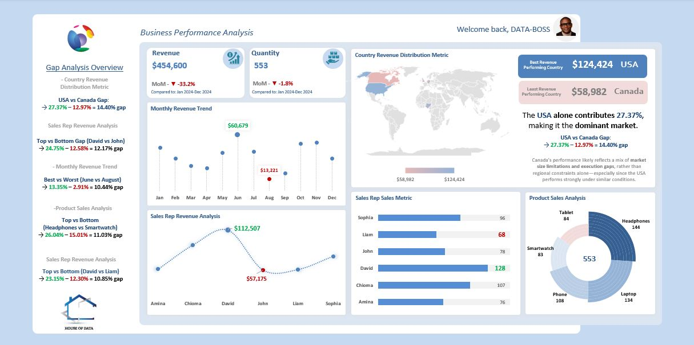
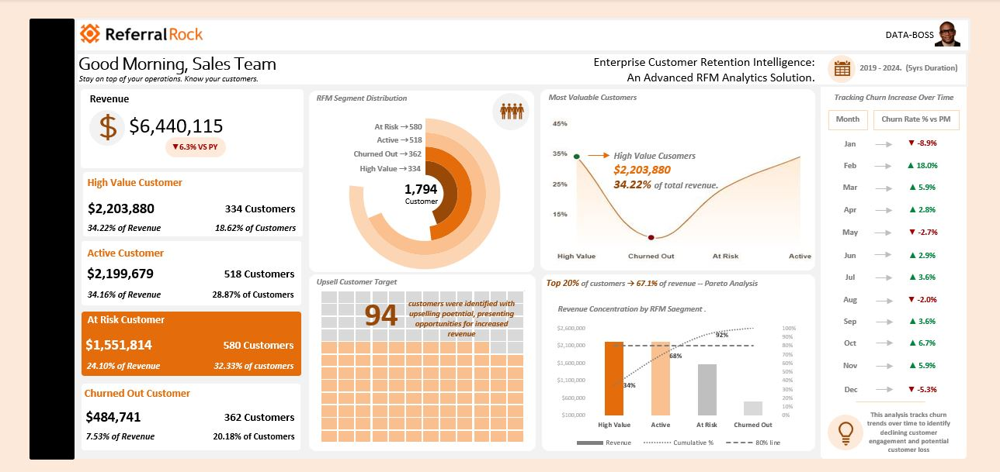
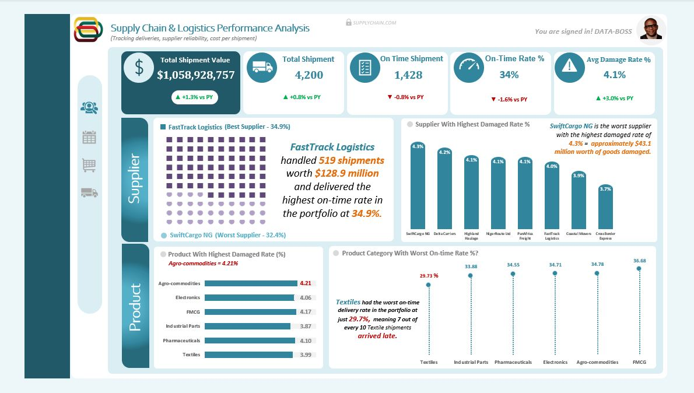
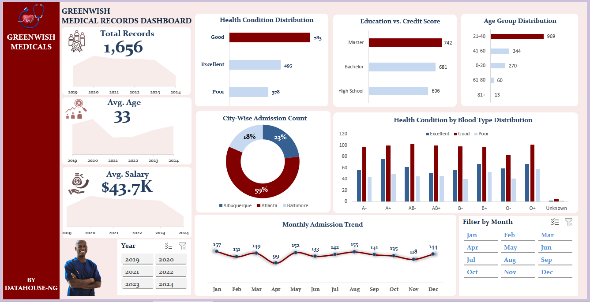
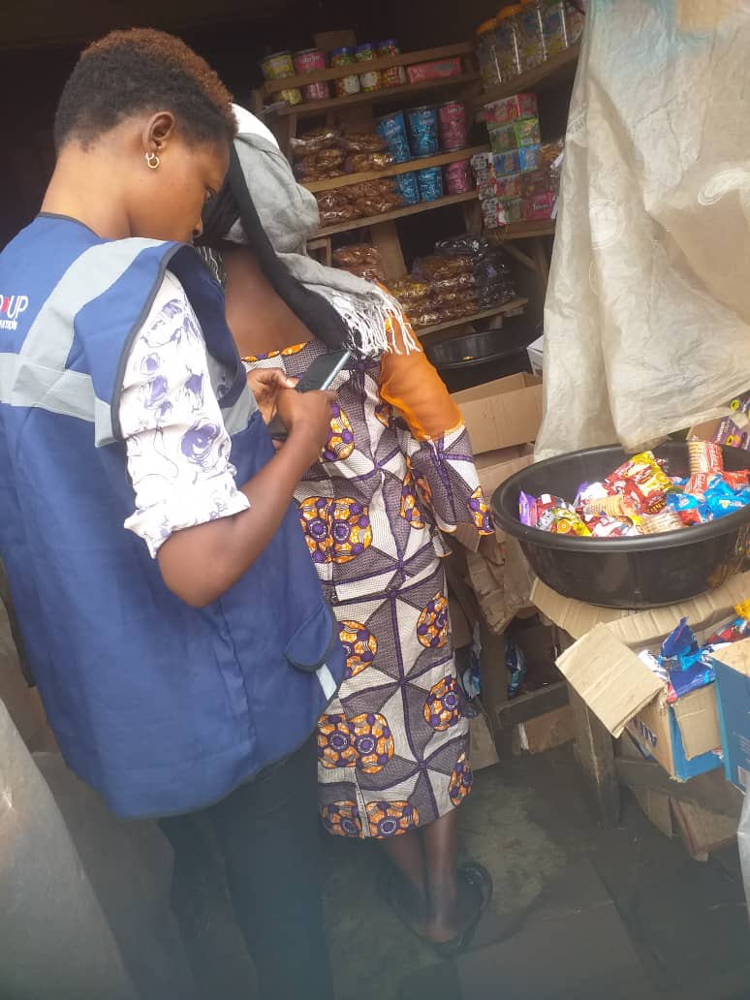

<!--Section 1: Introduce your self-->
## ABOUT ME

Hello! I'm Eniola Oluwashola, a professional data analyst, visualizaton specialist, educator, data researcher, data aggregator and a  data collector. 

I'm a Microsoft Certified Data Analyst and Business Analyst with a background most "data people" don't have: I've collected the data myself; running large-scale FMCG retail audits and market research fieldwork, before I ever built a dashboard from it. That ground-up view shapes how I work now. I don't just visualize numbers; I question where they came from, what's missing, and what decision they're meant to support.

I'm currently open to a full-time remote Data Analyst role in operations, international development, sales & customers or fintech, and ready to bring all of this directly to one team.

## ACHIEVEMENT

- Delivered 6000 retail audits for Pladis Global across 6 States in Nigeria, using the Kobo Toolbox for raw data collection, data & business analysis and the building of executive dashboards that aided management business decisions.

- Delivered a nationwide market research project with a new entrant (CHLOE Diaper) into the disposable diaper industry (Surveyed 350 wholesales stores, 750 retail stores, 100 Key-In-depth Interviews, 25 Focus Group Discussions) across key cities in Nigeria.

- Delivered retail audit for Pladis Global Nigeria, aggregating data of approximately 5000 retail outlets in open-air markets and neighborhoods (Lagos Only) and also using the Kobo Toolbox for raw data collection.

- Trained over 5,000  across Data Analysis, Business Analysis, Project Management, UI/UX, AI, Agile Delivery (Scrum & Kanban), Monday.com, and KoboToolbox-based field research.

<!--Mention your top/relevant skills here - core and soft skills-->
## WHAT I DO

I'm a Data & Business Analyst who builds the executive dashboards, models, and reports organizations use to make decisions; across operations, international development, sales & customers, fintech, FMCG,and  NGO/international development.

Over 10+ years, I've run market research and field data collection projects (KoboToolbox), built Power BI and Excel dashboards for supply chain, microfinance, and public health teams, and turned messy field-level data into KPIs that the leadership can act on.

I've also trained 7,000+ professionals in Data Analysis, Business Analysis, Power BI, SQL, and Agile delivery, which means I'm just as comfortable explaining the "why" behind a number to a non-technical stakeholder as I am building the dashboard itself.

I'm looking for a full-time, remote Data Analyst or Business Analyst role where I can bring that same rigor to one team. 

## Technical Skills

- **Data Analysis & Visualization** — Power BI, Tableau, Excel; executive-ready, decision-driving dashboards
- **Data Wrangling & Quality Assurance** — SQL queries and Excel Power-Query for cleaning and structuring data at scale
- **Business & Requirements Analysis** — stakeholder interviews, process mapping, BRDs
- **Data & Market Research** — quantitative and qualitative study design, fieldwork, reporting
- **Mobile Data Collection & Aggregation** — KoboToolbox form design, field deployment, large-scale data cleaning
- **KPI & Performance Reporting** — sales, supply chain, M&E, RFM Analysis (customer segmentation), and portfolio-risk dashboards.

## Soft Skills

- **Stakeholder Communication** — translating technical findings into language executives and non-technical teams can act on immediately
- **Cross-Sector Adaptability** — comfortable moving between FMCG, NGO/international development, and fintech contexts without a learning-curve tax
- **Mentorship & Knowledge Transfer** — trained 7,000+ professionals, which means I default to explaining reasoning, not just handing over output
- **Remote & Distributed Coordination** — used to managing field teams, deadlines, and stakeholder check-ins across multiple locations and time zones, asynchronously
- **Problem Diagnosis** — comfortable sitting with ambiguous or incomplete data and figuring out what question it can actually answer
- **Attention to Detail** — a data-collection background means I catch quality issues before they become a dashboard's bad assumption

<!--Section 2: List 3-4 key projects-->
## MY PROJECTS

**Case Study 1 - Executive Sales Analytics Dashboard: Revenue Optimization and Performance Intelligence.**

  

**Tech Stack:** Power Query, Power Pivot, DAX, Excel (PivotTables, Conditional Formatting, Charts & Dashboard Design)

Data was cleaned, transformed and loaded using Power Query, then modeled in Power Pivot using a star schema with a dedicated date table built for time series analysis. DAX measures powered the month over month calculations and the gap analysis behind each KPI, and Excel PivotTables, conditional formatting, and native charting tools brought the executive dashboard to life.

**Business Problem**

The business experienced declining revenue despite continued sales activity. Leadership needed visibility into sales performance, product contribution, market effectiveness, and revenue trends to identify growth opportunities and close performance gaps.

**Executive Summary**

Using Excel, I built a Sales Performance Dashboard to evaluate revenue trends, sales representative performance, product distribution, and geographic market contribution.

The analysis showed $454.6K in revenue from 553 units sold, with revenue down 33.2% month over month while quantity sold fell only 1.8%. The dashboard exposed clear performance gaps across sales reps, products, and markets, and turned those gaps into specific, actionable steps for revenue recovery.

**Key Insights**

**Revenue Performance**

- Total Revenue: $454.6K
- Revenue Growth: -33.2% MoM
- Quantity Sold: 553 Units
- Quantity Growth: -1.8% MoM

Revenue fell more than eighteen times faster than unit volume. That gap points to pricing, discounting, or product mix changes as the driver of the decline, not a drop in demand.

**Monthly Revenue Trend**

- Highest Revenue Month: June ($60,679)
- Lowest Revenue Month: August ($13,221)

Revenue dropped 78.2% from June to August. A swing that steep is too large for normal seasonal variation and is worth investigating directly, whether it traces back to a stocking issue, a paused campaign, or a one-time event.

**Sales Rep Performance**

- Top Performer: David ($112,507)
- Lowest Performer: John ($57,175)

David generated 96.8% more revenue than John, the lowest-performing rep. That gap is large enough to justify documenting David's approach and sharing it across the team.

**Market Performance**

- Highest Revenue Market: USA ($124,424)
- Lowest Revenue Market: Canada ($58,982)

The USA contributed 27.37% of total revenue and generated 111% more revenue than Canada. That creates a growth opportunity in the USA, but also a concentration risk if the business leans too heavily on a single market.

**Product Performance**

- Top Product: Headphones (144 Units)
- Lowest Product: Smartwatch (83 Units)

Headphones made up 26.04% of total sales volume, the highest share of any product, while Smartwatch trailed at 15.01%, the lowest. That gap points to room for rebalancing the product portfolio.

**Recommendations**

1. Investigate the pricing, discounting, and product mix changes behind the 33.2% revenue decline.
2. Document David's sales approach and share it across the team to close the gap with lower-performing reps.
3. Increase investment in the USA, the strongest market, while building a clear growth plan for Canada.
4. Prioritize inventory and marketing spend on the top-selling products: Headphones, Laptop, and Phone.
5. Review Smartwatch and Tablet, the two lowest-selling products, for repositioning, bundling, or discontinuation.

**Business Impact**

This analysis:

- Identified a 33.2% revenue decline before it could grow into a larger business risk.
- Revealed a 96.8% performance gap between the top and bottom sales representatives.
- Highlighted a 111% revenue gap between the USA and Canada, the highest and lowest performing markets.
- Exposed a 73.5% volume gap between Headphones and Smartwatch, showing both a concentration risk and an opportunity to rebalance the product mix.
- Turned these findings into specific recommendations for revenue recovery and stronger sales execution.

**Business Impact Statement**

I built an Excel-based Sales Performance Dashboard to track revenue trends, sales team effectiveness, product performance, and market contribution. The dashboard surfaced a 33.2% revenue decline against a flat 1.8% drop in volume, a 96.8% gap between the top and bottom sales reps, and a 111% revenue gap between the strongest and weakest markets, then converted those findings into a clear set of recommendations for revenue recovery and stronger sales execution.

**Case Study 2 - Enterprise Customer Retention Intelligence Using RFM Analytics**

**Tech Stack:** Excel, Power Query, Power Pivot, DAX, PivotTables, Conditional Formatting, Data Modelling.

Customer data was transformed and loaded using Power Query, then modeled in Power Pivot. RFM scores were calculated using the PERCENTILE function on a 1 to 10 scale for recency, frequency, and monetary value, then combined to classify customers into High Value, Active, At Risk, and Churned segments. DAX measures powered the year over year revenue comparison and the segment level metrics, while PivotTables and conditional formatting were used to build out the dashboard. I also did a data modelling using the star-schema and snowflakes.

**Business Problem**

The business lacked visibility into customer value, churn risk, and revenue concentration, even as overall revenue declined year over year. Leadership needed a clear way to identify high value customers, reduce churn, and uncover growth opportunities through customer segmentation.

**Executive Summary**

Using Excel and the RFM (Recency, Frequency, Monetary) framework, I built a Customer Retention Intelligence Dashboard that analyzed 1,794 customers across a five year period from 2019 to 2024. Total revenue stood at $6.44M, down 6.3% from the prior year. The analysis identified $1.55M in revenue at churn risk, uncovered 94 upsell opportunities, and showed that a small segment of customers drives most of the business's revenue.

**Key Insights**

**Revenue Is Declining Year Over Year**

- Total Revenue: $6,440,115 ($6.44M)
- Year over Year Change: -6.3% vs Prior Year

Revenue fell 6.3% compared to the prior year, the exact trend this RFM analysis was built to explain and reverse.

**High Value Customers Drive a Third of Revenue**

- Revenue: $2.20M
- Customers: 334
- Revenue Contribution: 34.22%

Only 18.62% of customers generate over a third of total revenue, which makes retaining this group a top priority.

**At Risk Customers Carry $1.55M in Exposure**

- Revenue at Risk: $1.55M
- Customers: 580
- Revenue Share: 24.10%

Nearly one third of customers, 32.33% of the base, show signs of declining engagement, creating a real revenue recovery opportunity if they are re engaged before they churn.

**Churn Has Already Cost the Business $484,741**

- Churned Customers: 362
- Revenue Lost: $484,741

More than 20% of customers, 20.18% of the base, have already disengaged, taking nearly half a million dollars in revenue with them.

**Revenue Is Concentrated Among a Small Group**

- Top 20% of customers generate 67.1% of total revenue

The business follows a classic Pareto pattern, which means it depends heavily on a relatively small group of high value customers.

**Upsell Opportunities Exist**

- 94 customers were identified as strong candidates for upselling and cross selling.

These 94 customers already show strong engagement, which makes them the fastest path to additional revenue without acquiring new customers.

**Churn Spiked in February and Eased in January**

- Highest Churn Increase: February (+18.0%)
- Largest Churn Reduction: January (-8.9%)

Churn moves up and down throughout the year, which means retention campaigns need to target specific high risk months rather than running at a constant pace year round.

**Recommendations**

1. Build a VIP retention program for the high value customers who contribute 34.22% of revenue.
2. Launch targeted recovery campaigns for the 580 at risk customers representing $1.55M in revenue.
3. Set up predictive churn monitoring with automated retention alerts.
4. Run personalized upsell campaigns for the 94 high potential customers.
5. Reduce revenue concentration risk by increasing engagement among Active and At Risk customers, the two largest segments outside the High Value group.

**Business Impact**

This dashboard enabled the business to:

- Identify $1.55M in revenue exposed to churn risk.
- Quantify $484,741 in lost revenue from customers who already churned.
- Discover 94 immediate upsell opportunities.
- Reveal that 67.1% of revenue comes from the top 20% of customers.
- Segment 1,794 customers into four groups, High Value, Active, At Risk, and Churned, each with a clear retention or growth action attached.

**Business Impact Statement**

I built an RFM based Customer Retention Intelligence Dashboard in Excel that segmented 1,794 customers into four groups based on recency, frequency, and monetary value. The dashboard identified $1.55M in at risk revenue, uncovered 94 upsell opportunities, and showed that the top 20% of customers generate 67.1% of total revenue. It gives leadership a clear view of where to focus retention efforts and where revenue is most exposed, backed by segment level evidence rather than guesswork.

**Case Study 3 - Supply Chain and Logistics Performance Analysis**

**Tech Stack:** Power BI, Power Query, DAX, Star Schema and Snowflake Modeling, Comprehensive Date Table

**Business Problem**

The business needed visibility into supplier reliability, on-time delivery performance, and damage rates across its supply chain to understand where shipments were falling short and which suppliers and product categories carried the most risk.

**Executive Summary**

I built a Supply Chain and Logistics Performance Dashboard that tracks $1.06 billion in shipment value across 4,200 shipments, broken down by supplier reliability, product category, on-time delivery, and damage rate.

The analysis found that only 34% of shipments arrive on time across the entire portfolio, a problem that holds true even for the best performing supplier and product category, while damage rates stay fairly consistent around 4% regardless of supplier or product.

**Key Insights**

**On-Time Delivery Is a Business Wide Problem**

- Total Shipments: 4,200, up 0.8% from last year
- On Time Shipments: 1,428, down 0.8% from last year
- On-Time Rate: 34%, down 1.6% from last year

Shipment volume grew slightly year over year, but on-time shipments actually fell, which means delivery performance is slipping even as the business ships more. This is not isolated to one supplier or category either, the best performing supplier still only reaches a 34.9% on-time rate, which means roughly two out of every three shipments across the portfolio arrive late.

**FastTrack Logistics Leads on Reliability**

- Shipments Handled: 519
- Shipment Value: $128.9M
- On-Time Rate: 34.9%

FastTrack Logistics delivers the highest on-time rate in the portfolio at 34.9%, only slightly above the 34% average, which shows that even the strongest supplier is operating in roughly the same underperforming range as everyone else.

**SwiftCargo NG Underperforms on Both Speed and Damage**

- On-Time Rate: 32.4%, the worst in the portfolio
- Damage Rate: 4.3%, the highest in the portfolio, equal to about $43.1M in damaged goods

SwiftCargo NG ranks worst on both on-time rate and damage rate, but the gap between SwiftCargo NG and the best supplier is only 2.5 percentage points on time and 0.6 percentage points on damage, which points to company wide inconsistency rather than one bad supplier.

**Damage Rates Stay Tight Across Suppliers and Products**

- Highest Supplier Damage Rate: SwiftCargo NG, 4.3%
- Lowest Supplier Damage Rate: Cross Border Express, 3.7%
- Highest Product Damage Rate: Agro-commodities, 4.21%
- Lowest Product Damage Rate: Industrial Parts, 3.87%

Damage rates cluster tightly around the 4.1% portfolio average no matter which supplier or product is involved, which points to a shared operational cause such as handling or packaging rather than a single weak link.

**Textiles Has the Worst On-Time Performance of Any Product Category**

- Textiles: 29.73% on time
- Industrial Parts: 33.88% on time
- Pharmaceuticals: 34.55% on time
- Electronics: 34.71% on time
- Agro-commodities: 34.78% on time
- FMCG: 36.68% on time

Textiles shipments arrive late about 7 out of every 10 times, the worst on-time rate of any category, while even FMCG, the best performing category, still arrives late more than 6 out of every 10 times.

**Agro-commodities Carries the Highest Product Damage Risk**

- Agro-commodities: 4.21%
- FMCG: 4.17%
- Pharmaceuticals: 4.10%
- Electronics: 4.06%
- Textiles: 3.99%
- Industrial Parts: 3.87%

Agro-commodities combines a high damage rate with one of the stronger on-time rates, while Textiles shows the opposite pattern, holding up fine on damage but falling badly on speed, which means damage and delay are likely driven by different root causes.

**Recommendations**

1. Treat the 34% on-time rate as a company wide issue rather than a supplier specific one, since even the best supplier and best product category still miss the on-time target most of the time.
2. Investigate the root cause of late Textiles shipments specifically, given a 29.73% on-time rate means most of this category arrives late.
3. Audit packaging and handling processes across all suppliers, since the consistently tight 3.7% to 4.3% damage rate range points to a shared process issue rather than one supplier's fault.
4. Review SwiftCargo NG's operations directly, since it ranks worst on both on-time rate and damage rate, even though the gap to other suppliers is small.
5. Study what FastTrack Logistics does differently to reach a 34.9% on-time rate, and test whether that approach can be applied to other suppliers.
6. Set a clear on-time delivery target and track progress against it monthly, since the current 34% rate leaves substantial room for improvement before reaching an acceptable service level.

**Business Impact**

This dashboard enabled the business to:

- Track $1.06 billion in shipment value across 4,200 shipments.
- Identify that only 34% of shipments arrive on time across the entire portfolio.
- Pinpoint SwiftCargo NG as the weakest supplier on both on-time rate and damage rate.
- Reveal that Textiles has the worst on-time performance of any product category at 29.73%.
- Show that damage rates stay consistent across suppliers and products, pointing to a shared operational cause.
- Replace fragmented shipment tracking with one view of supplier, product, and delivery performance.

**Business Impact Statement**

I built a Supply Chain and Logistics Performance Dashboard that tracks $1.06 billion in shipment value and 4,200 shipments across supplier, product, on-time delivery, and damage rate metrics. The analysis found that only 34% of shipments arrive on time across the entire portfolio, a gap that holds even for the best performing supplier and product category, while damage rates stay consistent around 4% regardless of supplier or product. It gives logistics leadership a clear view of where delivery and damage problems start, and a way to track progress as fixes get put in place.

**Case Study 4 - Greenwish Medical Records Intelligence Dashboard**

**Tech Stack**: Excel, Power Query, DAX, Star Schema and Snowflake Modeling, Dedicated Date Table for Time Series Analysis.

**Business Problem**

Greenwish Medicals needed a clear view of patient demographics, health outcomes, and admission patterns across its facilities to support staffing, resource planning, and patient care decisions. Without a consolidated view, it was difficult to see which patient groups, locations, and time periods needed the most attention.

**Executive Summary**

I built a Medical Records Dashboard that brings together patient demographics, health condition outcomes, admission trends, and city level admission data across 1,656 patient records from 2019 to 2024.

The analysis found that most patients report good or excellent health outcomes, that admissions concentrate heavily in the 21 to 40 age group and in Atlanta, and that admission volume swings sharply month to month, with January the busiest month of the year and April the slowest.

**Key Insights**

**Patient Records Span Six Years**

- Total Records: 1,656
- Average Age: 33
- Average Salary: $43.7K
- Date Range: 2019 to 2024

This gives the hospital a six year baseline to track how patient demographics and outcomes shift over time.

**Health Outcomes Skew Positive**

- Good: 783 patients
- Excellent: 495 patients
- Poor: 378 patients

Good or excellent outcomes account for 1,278 of 1,656 patients, about 77% of the total, while poor outcomes make up the remaining 23%, giving the hospital a clear baseline ratio to monitor going forward.

**Admissions Concentrate in Working Age Adults**

- 21 to 40: 969 patients
- 41 to 60: 344 patients
- 0 to 20: 270 patients
- 61 to 80: 60 patients
- 81 and older: 13 patients

Patients between 21 and 40 make up 969 of 1,656 records, about 58.5% of the total, making this age band the main driver of admission volume and the most important group for staffing and care planning.

**Atlanta Drives the Majority of Admissions**

- Atlanta: 59%
- Albuquerque: 23%
- Baltimore: 18%

Atlanta alone accounts for more than half of all admissions across the three cities, which points to either a larger patient base in that location or a capacity strain worth investigating.

**Credit Score Rises With Education Level**

- Master's degree: average credit score of 742
- Bachelor's degree: average credit score of 681
- High school: average credit score of 606

Average credit score climbs with education level, with Master's degree patients averaging 136 points higher than patients with only a high school education, a gap that likely reflects broader income and financial stability differences across these groups.

**Admission Volume Changes Month to Month**

- Highest Month: January (157 admissions)
- Lowest Month: April (99 admissions)

January runs 58.6% higher than the April low point, a swing large enough to affect staffing and resource planning if the pattern repeats year over year.

**Recommendations**

1. Plan staffing and bed capacity around the January admission peak, and build in slack for the steep April drop.
2. Investigate why Atlanta accounts for 59% of admissions relative to Albuquerque and Baltimore, since this could reflect patient base size or capacity strain.
3. Build targeted outreach and preventive care programs for patients in the 21 to 40 age band, since they make up the majority of the patient population.
4. Track the 23% of patients reporting poor health outcomes more closely to catch and address declines earlier.
5. Use the relationship between education level and credit score to tailor billing communication and financial counseling by patient group.
6. Review admission and outcome patterns by blood type over time to see whether differences across groups are meaningful or just a result of smaller sample sizes for rarer blood types.

**Business Impact**

This dashboard enabled hospital leadership to:

- Track 1,656 patient records across six years from 2019 to 2024.
- Identify that 77% of patients report good or excellent health outcomes.
- Reveal that Atlanta accounts for 59% of total admissions across three cities.
- Surface a 58.6% swing in admissions between the slowest month, April, and the busiest, January.
- Connect education level to average credit score for more targeted patient communication.
- Replace scattered reports with one consistent view of demographics, outcomes, and admission patterns.

**Business Impact Statement**

I built a Medical Records Dashboard for Greenwish Medicals that brings patient demographics, health outcomes, and admission trends across 1,656 records from 2019 to 2024 into one view. The analysis showed that 77% of patients report good or excellent health, that admissions concentrate in the 21 to 40 age group and in Atlanta specifically, and that admission volume can swing by more than 58% between the slowest and busiest months. It gives hospital leadership a clearer way to plan staffing, target patient outreach, and monitor health outcomes across locations and demographics.

**Case Study 5 - Delivered 6000 retail audit for Pladis Global across 6 States in Nigeria using Kobo Toolbox for raw data collection & data aggregation.**

 

Software: KOBO TOOLBOX

### Branded Data Collectors Using Kobo Toolbox

By utilizing Kobo Toolbox with our branded data collectors, we improve the efficiency, accuracy, and reliability of our data collection processes, supporting better decision-making and strategic planning.

**Projects Achieved With Kobo Toolbox (Data Collection & Aggregation)**:
 
 - Delivered 6000 retail audits for Pladis Global across 6 States in Nigeria, using the Kobo Toolbox for raw data collection.

- Delivered a nationwide market research project with a new entrant (CHLOE Diaper) into the disposable diaper industry (Surveyed 350 wholesales stores, 750 retail stores, 100 Key-In-depth Interviews, 25 Focus Group Discussions) across key cities in Nigeria.

- Delivered retail audit for Pladis Global Nigeria, aggregating data of approximately 5000 retail outlets in open-air markets and neighborhoods (Lagos Only) and also using the Kobo Toolbox for raw data collection.

- Trained over 5,000 in Data Analytics covering Data Research & Data Aggregation (Kobo Toolbox), Advanced Data Visualization. Power-BI, Excel, SQL & Tableau.

## CONTACT DETAILS

*Let’s connect and see how we can make a difference together!*
<table>
  <tbody>
    <tr>
      <td>📧</td>
      <td><a href="mailto:eniolaoluwasholao@gmail.com">eniolaoluwasholao@gmail.com</a></td>
    </tr>
    <tr>
      <td>📞</td>
      <td>(234) 916-602-0709</td>
    </tr>
    <tr>
      <td>📍</td>
      <td>Lagos, Nigeria</td> 
