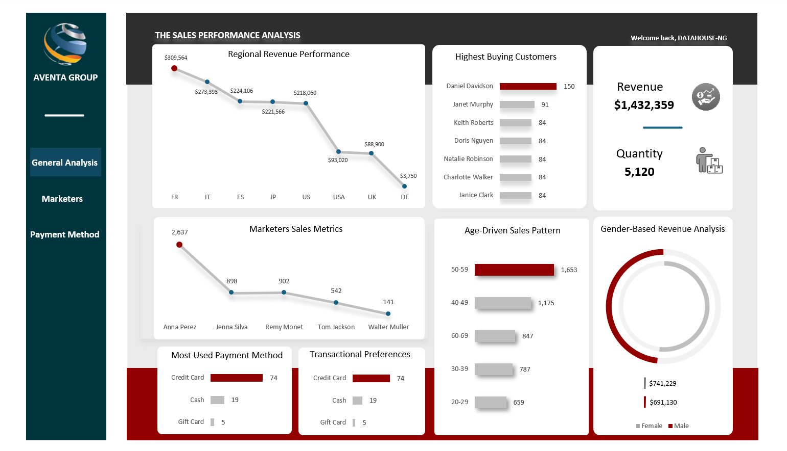

<!--Section 1: Introduce your self-->
## ABOUT ME

Hello! I'm Eniola Oluwashola, a professional data analyst, visualizaton specialist, educator, data researcher, data aggregator and a  data collector. 

I'm a Microsoft Certified Data Analyst and Business Analyst with a background most "data people" don't have: I've collected the data myself; running large-scale FMCG retail audits and market research fieldwork, before I ever built a dashboard from it. That ground-up view shapes how I work now. I don't just visualize numbers; I question where they came from, what's missing, and what decision they're meant to support.

I'm currently open to a full-time remote Data Analyst role in operations, international development, sales & customers or fintech, and ready to bring all of this directly to one team.

## ACHIEVEMENT

- Delivered 6000 retail audits for Pladis Global across 6 States in Nigeria, using the Kobo Toolbox for raw data collection, data & business analysis and the building of executive dashboards that aided management business decisions.

- Delivered a nationwide market research project with a new entrant (CHLOE Diaper) into the disposable diaper industry (Surveyed 350 wholesales stores, 750 retail stores, 100 Key-In-depth Interviews, 25 Focus Group Discussions) across key cities in Nigeria.

- Delivered retail audit for Pladis Global Nigeria, aggregating data of approximately 5000 retail outlets in open-air markets and neighborhoods (Lagos Only) and also using the Kobo Toolbox for raw data collection.

- Trained over 5,000  across Data Analysis, Business Analysis, Project Management, UI/UX, AI, Agile Delivery (Scrum & Kanban), Monday.com, and KoboToolbox-based field research.

<!--Mention your top/relevant skills here - core and soft skills-->
## WHAT I DO

I'm a Data & Business Analyst who builds the executive dashboards, models, and reports organizations use to make decisions; across operations, international development, sales & customers, fintech, FMCG,and  NGO/international development.

Over 10+ years, I've run market research and field data collection projects (KoboToolbox), built Power BI and Excel dashboards for supply chain, microfinance, and public health teams, and turned messy field-level data into KPIs that the leadership can act on.

I've also trained 7,000+ professionals in Data Analysis, Business Analysis, Power BI, SQL, and Agile delivery, which means I'm just as comfortable explaining the "why" behind a number to a non-technical stakeholder as I am building the dashboard itself.

I'm looking for a full-time, remote Data Analyst or Business Analyst role where I can bring that same rigor to one team. 

## Technical Skills

- **Data Analysis & Visualization** — Power BI, Tableau, Excel; executive-ready, decision-driving dashboards
- **Data Wrangling & Quality Assurance** — SQL queries and Excel Power-Query for cleaning and structuring data at scale
- **Business & Requirements Analysis** — stakeholder interviews, process mapping, BRDs
- **Data & Market Research** — quantitative and qualitative study design, fieldwork, reporting
- **Mobile Data Collection & Aggregation** — KoboToolbox form design, field deployment, large-scale data cleaning
- **KPI & Performance Reporting** — sales, supply chain, M&E, RFM Analysis (customer segmentation), and portfolio-risk dashboards.

## Soft Skills

- **Stakeholder Communication** — translating technical findings into language executives and non-technical teams can act on immediately
- **Cross-Sector Adaptability** — comfortable moving between FMCG, NGO/international development, and fintech contexts without a learning-curve tax
- **Mentorship & Knowledge Transfer** — trained 7,000+ professionals, which means I default to explaining reasoning, not just handing over output
- **Remote & Distributed Coordination** — used to managing field teams, deadlines, and stakeholder check-ins across multiple locations and time zones, asynchronously
- **Problem Diagnosis** — comfortable sitting with ambiguous or incomplete data and figuring out what question it can actually answer
- **Attention to Detail** — a data-collection background means I catch quality issues before they become a dashboard's bad assumption

<!--Section 2: List 3-4 key projects-->
## MY PROJECTS

**Sales Performance Diagnostic & Revenue Optimization (Excel Case Study): A Multi-Dimensional Business Intelligence Analysis of Revenue Trends, Sales Team Effectiveness, Product Performance, and Geographic Market Contribution.**

**Tech Stack:** Power Query, Power Pivot, DAX, Excel (PivotTables, Conditional Formatting, Charts & Dashboard Design)

Data was cleaned, transformed and loaded using Power Query, then modeled in Power Pivot using a star schema with a dedicated date table built for time series analysis. DAX measures powered the month over month calculations and the gap analysis behind each KPI, and Excel PivotTables, conditional formatting, and native charting tools brought the executive dashboard to life.

**Business Problem**

The business experienced declining revenue despite continued sales activity. Leadership needed visibility into sales performance, product contribution, market effectiveness, and revenue trends to identify growth opportunities and close performance gaps.

**Executive Summary**

Using Excel, I built a Sales Performance Dashboard to evaluate revenue trends, sales representative performance, product distribution, and geographic market contribution.

The analysis showed $454.6K in revenue from 553 units sold, with revenue down 33.2% month over month while quantity sold fell only 1.8%. The dashboard exposed clear performance gaps across sales reps, products, and markets, and turned those gaps into specific, actionable steps for revenue recovery.

**Key Insights**

**Revenue Performance**

- Total Revenue: $454.6K
- Revenue Growth: -33.2% MoM
- Quantity Sold: 553 Units
- Quantity Growth: -1.8% MoM

Revenue fell more than eighteen times faster than unit volume. That gap points to pricing, discounting, or product mix changes as the driver of the decline, not a drop in demand.

**Monthly Revenue Trend**

- Highest Revenue Month: June ($60,679)
- Lowest Revenue Month: August ($13,221)

Revenue dropped 78.2% from June to August. A swing that steep is too large for normal seasonal variation and is worth investigating directly, whether it traces back to a stocking issue, a paused campaign, or a one-time event.

**Sales Rep Performance**

- Top Performer: David ($112,507)
- Lowest Performer: John ($57,175)

David generated 96.8% more revenue than John, the lowest-performing rep. That gap is large enough to justify documenting David's approach and sharing it across the team.

**Market Performance**

- Highest Revenue Market: USA ($124,424)
- Lowest Revenue Market: Canada ($58,982)

The USA contributed 27.37% of total revenue and generated 111% more revenue than Canada. That creates a growth opportunity in the USA, but also a concentration risk if the business leans too heavily on a single market.

**Product Performance**

- Top Product: Headphones (144 Units)
- Lowest Product: Smartwatch (83 Units)

Headphones made up 26.04% of total sales volume, the highest share of any product, while Smartwatch trailed at 15.01%, the lowest. That gap points to room for rebalancing the product portfolio.

**Recommendations**

1. Investigate the pricing, discounting, and product mix changes behind the 33.2% revenue decline.
2. Document David's sales approach and share it across the team to close the gap with lower-performing reps.
3. Increase investment in the USA, the strongest market, while building a clear growth plan for Canada.
4. Prioritize inventory and marketing spend on the top-selling products: Headphones, Laptop, and Phone.
5. Review Smartwatch and Tablet, the two lowest-selling products, for repositioning, bundling, or discontinuation.

**Business Impact**

This analysis:

- Identified a 33.2% revenue decline before it could grow into a larger business risk.
- Revealed a 96.8% performance gap between the top and bottom sales representatives.
- Highlighted a 111% revenue gap between the USA and Canada, the highest and lowest performing markets.
- Exposed a 73.5% volume gap between Headphones and Smartwatch, showing both a concentration risk and an opportunity to rebalance the product mix.
- Turned these findings into specific recommendations for revenue recovery and stronger sales execution.

**Business Impact Statement**

I built an Excel-based Sales Performance Dashboard to track revenue trends, sales team effectiveness, product performance, and market contribution. The dashboard surfaced a 33.2% revenue decline against a flat 1.8% drop in volume, a 96.8% gap between the top and bottom sales reps, and a 111% revenue gap between the strongest and weakest markets, then converted those findings into a clear set of recommendations for revenue recovery and stronger sales execution.

**How I helped Daxxon company to discover hidden metrics in their business data that influenced their performance by 45% in revenue and sales.**

.PNG)

Tech Stack: EXCEL.

I assisted Daxxon Company in uncovering hidden metrics within their business data, leading to a 45% increase in revenue and quantity sold by focusing on the following insights:

City Sales Performance: I analyzed sales data by city to identify top-performing regions, allowing Daxxon to target marketing efforts effectively.

1- Managers Evaluation: I evaluated manager performance metrics, highlighting effective strategies and areas for improvement, which helped optimize team productivity.

2- Payment Method Analysis: By examining payment methods, I identified preferences that influenced customer purchasing behavior, enabling tailored payment options.

3- Purchase Type Insights: I categorized purchase types to understand customer preferences, leading to targeted promotions that boosted sales.

4- Quantity Metrics: I analyzed quantity sold metrics to identify trends, helping the company adjust inventory and sales strategies accordingly.

5- Revenue Generation Timing: I pinpointed periods when Daxxon generated the highest revenue, allowing for strategic planning of sales campaigns during peak times.

Through these data insights, Daxxon company was able to make informed decisions that significantly enhanced their performance, resulting in a substantial increase in both revenue and quantity sold.

*A glimpse of some of the projects I've been working on.*   T

**How I helped GREENWISH MEDICALS to provide actionable insights into patient demographics, health 
conditions, and trends in admissions using their raw medical data, thereby increasing operational efficiency by 75%.**

Tech Stack: EXCEL.

As a data analyst, I was tasked with working on a healthcare dataset to develop an interactive Excel dashboard aimed at analyzing and visualizing key healthcare metrics. 
This dashboard is designed to deliver actionable insights into patient demographics, health conditions, trends in admissions, and enhancing overall operational efficiency by 75%.

In creating an interactive Excel dashboard for analyzing key healthcare metrics, I followed a structured approach:

1- Data Collection and Preparation: I performed data cleaning using the power query editor to ensure accuracy, and transformed the data for analysis by categorizing health conditions and creating calculated metrics.

2- Data Analysis: I conducted exploratory data analysis (EDA) to identify patterns and selected essential metrics for the dashboard, including patient demographics and admission trends.

3- I derived the KPIs by writing DAX Measures in Excel's power pivot engine. 

4- Dashboard Design: I designed a user-friendly layout, incorporating interactive features like slicers and drop-down menus to enhance user engagement and facilitate data filtering.

5- Data Visualization: I utilized various chart types to visualize the data effectively and applied conditional formatting to highlight key trends and insights.

6- Testing and Feedback: After the initial version was completed, I conducted user testing to gather feedback and made iterative improvements based on stakeholder input.

7- Finalization and Presentation: I created documentation for user navigation and presented the final dashboard to stakeholders, demonstrating its features and utility in making data-driven decisions.

Through this methodical process, I successfully developed a dashboard that provides valuable insights into patient demographics, health conditions, and admission trends, ultimately enhancing decision-making in healthcare management.

**The Aventa Group Transactional Metrics Analysis.**

Tech Stack: EXCEL.

The Aventa Group wants to know how and if regional performance, marketers sales metrics, customers, customer age group, gender, generates any transactional pattern, trends and hidden business discoveries. 

As a professional data analyst, I addressed The  Aventa Group's concerns about regional performance, sales metrics, customer demographics, and transactional patterns through the following steps:

1. Data Collection: I gathered data from sales records, customer databases, and regional reports to create a comprehensive dataset.

2. Data Cleaning: I cleaned the dataset to remove inconsistencies and categorize customers by age and gender.

3. Exploratory Data Analysis (EDA): I analyzed patterns and trends in sales metrics by region and demographics to uncover relationships.

4. Trend Analysis: I examined sales trends over time, focusing on contributions from different age groups and genders.

5. Pattern Recognition: I used data visualization to highlight hidden patterns in customer behavior and purchasing decisions.

6. Actionable Insights: I presented findings to the Aventa Group, offering insights to inform marketing strategies and enhance customer engagement.

This structured approach enabled the Aventa Group to solve their business concerns.

**How I helped Daxxon company to discover hidden metrics in their business data that influenced their performance by 45% in revenue and sales.**

.PNG)

Tech Stack: EXCEL.

I assisted Daxxon Company in uncovering hidden metrics within their business data, leading to a 45% increase in revenue and quantity sold by focusing on the following insights:

City Sales Performance: I analyzed sales data by city to identify top-performing regions, allowing Daxxon to target marketing efforts effectively.

1- Managers Evaluation: I evaluated manager performance metrics, highlighting effective strategies and areas for improvement, which helped optimize team productivity.

2- Payment Method Analysis: By examining payment methods, I identified preferences that influenced customer purchasing behavior, enabling tailored payment options.

3- Purchase Type Insights: I categorized purchase types to understand customer preferences, leading to targeted promotions that boosted sales.

4- Quantity Metrics: I analyzed quantity sold metrics to identify trends, helping the company adjust inventory and sales strategies accordingly.

5- Revenue Generation Timing: I pinpointed periods when Daxxon generated the highest revenue, allowing for strategic planning of sales campaigns during peak times.

Through these data insights, Daxxon company was able to make informed decisions that significantly enhanced their performance, resulting in a substantial increase in both revenue and quantity sold.

**PBI - Enhancing Business Performance with Exploratory Data Analysis in Power BI.**

Tech Stack: POWER-BI.

Using Exploratory Data Analysis (EDA) in Power BI, I discovered hidden metrics that contributed to a 35% increase in overall business performance.

1- Subcategory Performance: I analyzed sales data by subcategory, identifying high-performing and underperforming segments. This insight allowed for targeted marketing and inventory adjustments.

2- Identifying Least Profitable Periods: I calculated the least profitable periods by examining sales and profit trends over time. This analysis helped the company recognize and address seasonal dips in performance.

3- Customer Analysis: I conducted a detailed customer analysis to segment customers based on purchasing behavior, preferences, and profitability. This understanding enabled personalized marketing strategies to enhance customer engagement.

4- Shipping Breakdown: I examined shipping data to identify cost patterns and delivery times, allowing for optimization of shipping processes and reduction of costs associated with logistics.

5- Sales Performance Analysis: I evaluated sales performance in relation to revenue, profit, and average sales metrics. This comprehensive view provided insights into overall business health and areas for improvement.

Through these EDA techniques in Power BI, I uncovered critical metrics that informed strategic decisions, ultimately leading to a significant boost in business performance.

**Delivered 6000 retail audit for Pladis Global across 6 States in Nigeria using Kobo Toolbox for data collection & data aggregation.**

Software: KOBO TOOLBOX

### Branded Data Collectors Using Kobo Toolbox

By utilizing Kobo Toolbox with our branded data collectors, we improve the efficiency, accuracy, and reliability of our data collection processes, supporting better decision-making and strategic planning.

**Projects Achieved With Kobo Toolbox (Data Collection & Aggregation)**:
 
 - Delivered 6000 retail audits for Pladis Global across 6 States in Nigeria, using the Kobo Toolbox for raw data collection.

- Delivered a nationwide market research project with a new entrant (CHLOE Diaper) into the disposable diaper industry (Surveyed 350 wholesales stores, 750 retail stores, 100 Key-In-depth Interviews, 25 Focus Group Discussions) across key cities in Nigeria.

- Delivered retail audit for Pladis Global Nigeria, aggregating data of approximately 5000 retail outlets in open-air markets and neighborhoods (Lagos Only) and also using the Kobo Toolbox for raw data collection.

- Trained over 5,000 in Data Analytics covering Data Research & Data Aggregation (Kobo Toolbox), Advanced Data Visualization. Power-BI, Excel, SQL & Tableau.

## CONTACT DETAILS

*Let’s connect and see how we can make a difference together!*
<table>
  <tbody>
    <tr>
      <td>📧</td>
      <td><a href="mailto:eniolaoluwasholao@gmail.com">eniolaoluwasholao@gmail.com</a></td>
    </tr>
    <tr>
      <td>📞</td>
      <td>(234) 916-602-0709</td>
    </tr>
    <tr>
      <td>📍</td>
      <td>Lagos, Nigeria</td> 
